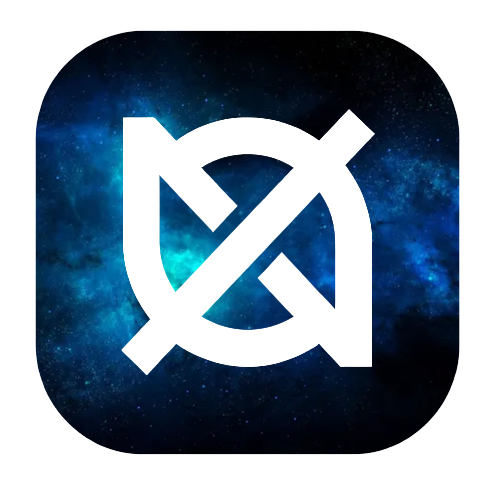

<div align="center">
  
  
  <h1>Null</h1>
  
  <p>
    <strong>Un clon de Discord desarrollado desde cero.</strong>
  </p>

  <p>
    
    
    
    
  </p>
</div>

---

## 📋 Descripción

**Null** es una aplicación de chat en tiempo real inspirada en Discord. Este proyecto representa un hito importante en mi carrera como desarrollador, ya que es **mi primer proyecto Full Stack desarrollado completamente por mi cuenta**.

El objetivo principal fue entender y aplicar la arquitectura de WebSockets para la comunicación bidireccional, la persistencia de datos NoSQL y la gestión de estados de usuario en tiempo real.

## 🚀 Características Principales

* **Comunicación en Tiempo Real:** Chat fluido utilizando WebSockets (STOMP & SockJS).
* **Usuarios Conectados:** Lista dinámica de usuarios que muestra quién está *Online* y *Offline* al instante.
* **Mensajería Privada:** Envío de mensajes 1 a 1 dirigidos a usuarios específicos.
* **Persistencia de Datos:** Historial de chat guardado en MongoDB (los mensajes no se pierden al recargar).
* **Notificaciones Visuales:** Indicadores de mensajes nuevos cuando el chat no está activo.

## 🛠️ Tecnologías Utilizadas

### Backend
* **Java 17**
* **Spring Boot 3** (Web, WebSocket, Data MongoDB)
* **Lombok** (Para reducir el código repetitivo)

### Frontend
* **HTML5 & CSS3** (Diseño responsivo y moderno)
* **Vanilla JavaScript** (Lógica del cliente sin frameworks pesados)
* **SockJS & Stomp.js** (Cliente para la conexión WebSocket)

### Base de Datos
* **MongoDB** (Almacenamiento de usuarios y mensajes)

## 📸 Capturas de Pantalla

<div align="center">
  </div>

## 🔧 Instalación y Ejecución

Sigue estos pasos para correr el proyecto en tu máquina local:

1.  **Clonar el repositorio:**
    ```bash
    git clone [https://github.com/Fernand-O-band01/null.git](https://github.com/Fernand-O-band01/null.git)
    cd null
    ```

2.  **Configurar MongoDB:**
    Asegúrate de tener MongoDB corriendo localmente o configura la URI en `src/main/resources/application.properties`.

3.  **Ejecutar el Backend:**
    ```bash
    mvn spring-boot:run
    ```

4.  **Acceder a la aplicación:**
    Abre tu navegador y visita: `http://localhost:8080`

## 🧠 Aprendizajes

Durante el desarrollo de **Null**, enfrenté y superé varios desafíos técnicos:
* Configuración correcta del **Broker de Mensajería** en Spring para rutas públicas y privadas.
* Manejo de **IDs únicos en MongoDB** para evitar duplicidad de usuarios.
* Sincronización del estado del cliente (Frontend) con los eventos del servidor.

## 🤝 Contribución

Este es un proyecto educativo, ¡pero cualquier sugerencia es bienvenida! Si tienes ideas para mejorarlo, siéntete libre de abrir un *issue* o enviar un *pull request*.

## ✒️ Autor

* **Fernando Obando** - *Trabajo Inicial* - [Fernand-O-band01](https://github.com/Fernand-O-band01)

---
<div align="center">
  <sub>⌨️ con ❤️ por <a href="https://github.com/Fernand-O-band01">Fernando Obando</a></sub>
</div>
